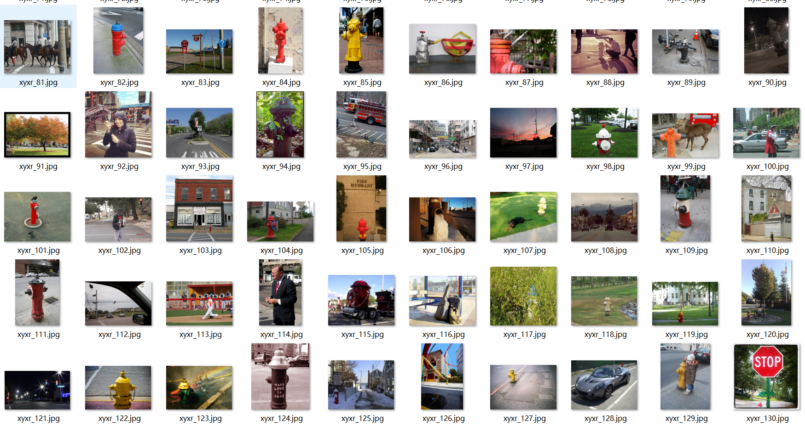
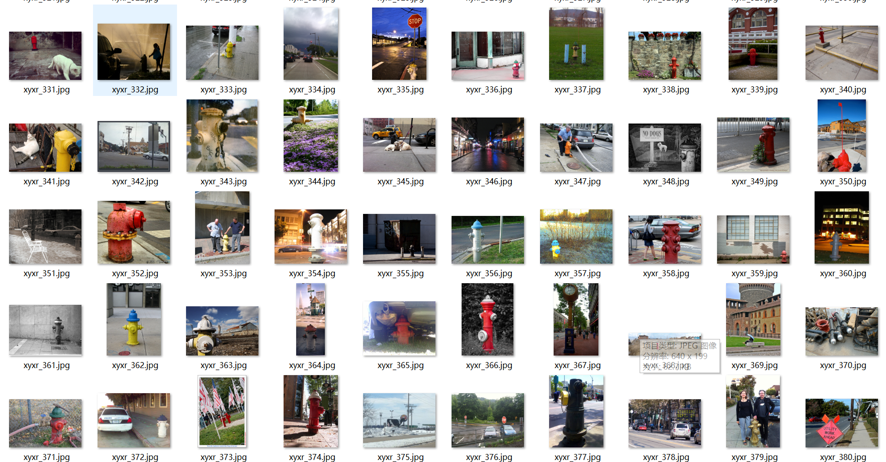
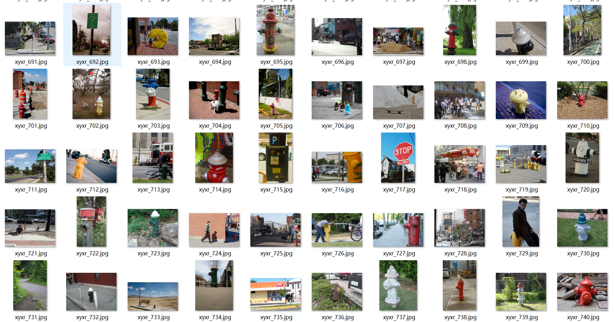

# [Object Detection] Fire hydrant Detection Dataset 1711 imagesVOC+YOLO format

Dataset Description: ~

The dataset for fire hydrant inspection contains 1711 VOC+yolo format .7z files.

VOC+yoloformat

jpgImage 1711stretch

xmlFile pieces number ：1711

txtFile pieces number ：1711

Number of categories: 1

Annotation class names: ["fire hydrant"]

Number of boxes labeled in each category:

fire hydrant frame count = 1865

Total boxes: 1865

Use the labeling tool: labelImg

## Images

---

Here is a pay link on Stripe (https://buy.stripe.com/3cs8yP7sY87d0vu9AB). Please contact me lonlonago@foxmail.com after funding $89, and I will send you a complete data files, thank you!

